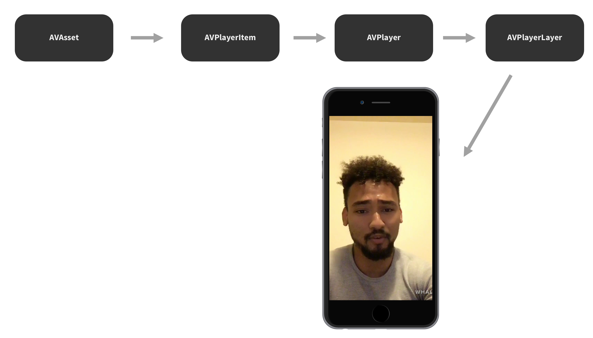

# Working with AVFoundation - Playing Videos

### Objectives

- Setup AVFoundation to display videos
- Play/Pause videos
- Observe progress of video

## AVPlayer

Controls the playback of assets(video or audio).
Allows starting, stoping and seeking a playback item
AVPlayer plays a single asset

Typically display the video from playback to a Core Animation layer
You synchronize the video playback on an AVPlayerLayer or AVSynchronizedLayer

### Displaying Video

There are two ways of displaying video onto the screen

**AVKit** - Provided by Apple, displays video and playback controls automatically

**AVPlayerLayer** - Use this if you are building a custom video player interface

If you use the AVPlayerLayer, you will have to build playback controls yourself (play, pause, seek)

The layer can be set as the main backing layer of the view or added as a subview

```swift
fileprivate var playerLayer: AVPlayerLayer {
    return layer as! AVPlayerLayer
}

override class var layerClass: AnyClass {
    get {
        return AVPlayerLayer.self
    }
}
```
self.layer is now an AVPlayerLayer

** AVSynchronizedLayer** - A special CALayer that can synchronizes timing with an AVPlayer. Eg. Rendering subtitles on a video

### Playing an Asset

There are two types of assets you can play with AVPlayer, a local file, or stream based online assets.

To play an asset, an AVPlayerItem is passed to the AVPlayer for playback

```swift
let playerItem = AVPlayerItem(url: URL(string: "some-url")!)
let avPlayer = AVPlayer(item: playerItem)

@IBAction func playPressed(_ sender: UIButton) {
    avPlayer.play()
}
```



#### VideoGravity
This specifies the aspect ratio of the asset for playblack, use AVLayerVideoGravityResizeAspectFill if you want it to use the original aspect ratio of the asset

### Controlling playback

Controlling playback of an asset is done by changing the playback rate.
The playback rate controls the rate of play of the playeritem.
Set the playback rate to 0 to pause, set it to 1 to play, setting it to 2 plays the item at twice the speed.
You can also use the **play()** and **pause()** functions on AVPlayer, it changes the playback rate under the hood.

#### Seeking
You can move the playhead to a particular time in the asset with:

```swift
player.seek(to: kCMTimeZero)
```


### Playing multiple items with AVQueuePlayer

Its a subclass of AVPlayer that allows you to play multiple items in sequence

```swift
let playerItems = videoURLs.videos.map{AVPlayerItem(url: $0)}
let queuePlayer = AVQueuePlayer(items: playerItems)

// Move to next item in queue when done playing
self.player.actionAtItemEnd = .advance
```

AVQueuePlayer plays items in turn, if you want to move to the next item, use the advanceToNextItem() on AVQueuePlayer

### Looping a playback item with AVPlayerLooper

AVPlayerLooper loops a single playback item.
You can do that manually by seeking the time to the beginning when the playback items ends, but AVPlayerLooper provides a better interface for looping an item.


### Monitoring Playback

Monitoring playback on AVPlayer primarily uses KVO

> Important: You should register for KVO change notifications and unregister from KVO change notifications on the main thread. This avoids the possibility of receiving a partial notification if a change is being made on another thread. AV Foundation invokes observeValueForKeyPath:ofObject:change:context: on the main thread, even if the change operation is made on another thread.
Responding


```swift
override func observeValue(forKeyPath keyPath: String?, of object: Any?, change: [NSKeyValueChangeKey : Any]?, context: UnsafeMutableRawPointer?) {
        if keyPath == "rate" {
            guard let newRate = change?[NSKeyValueChangeKey.newKey] as? NSNumber else {return}
            self.addTimeObserver()
            
            if newRate.floatValue <= 0 {
                removeTimeObserver()
                delegate?.playerDidEnd()
            }
        }
    }
```
### Tracking time

AVPlayer provides two methods to observe time changes:

To track the current time of the current playback item, you use the 

```swift
addPeriodicTimeObserver(forInterval:queue:using:)
```

You must pass in a serial queue, concurrent queues are not supported
Use this to display, time elapsed, remaining


There is also addBoundaryTimeObserver(forTimes:queue:using:) that runs a block when a defined time is crossed by the playback item

## AVPlayer Gotchas
- Remember to set the privacy settings in your info.plist
- Don't forget to unsubscribe from any notifications when you dismiss the view listing to notifications
