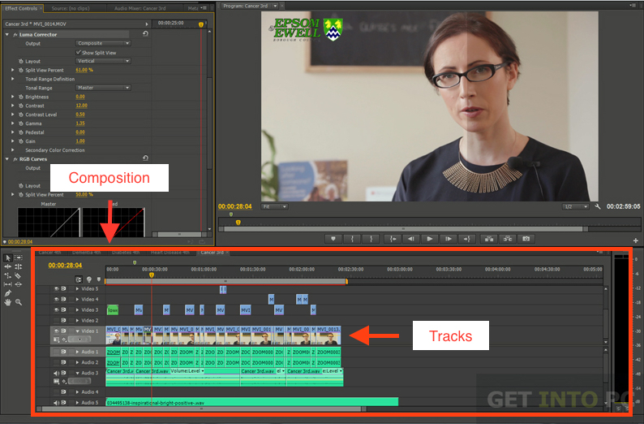
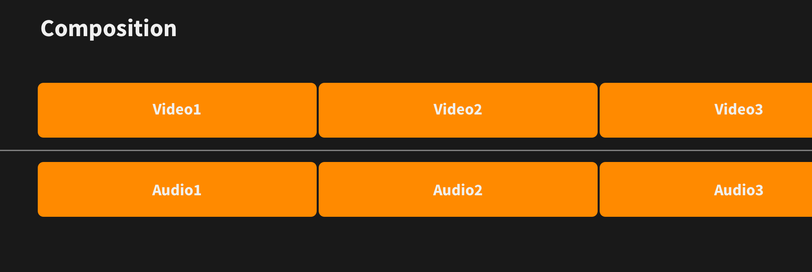

# Working with AVFoundation - Editing Video & Audio

### Objectives

- Compose video & audio assets
- Exporting edited video/audio

## Editing Video
### Terms

##### Asset
##### Composition
##### Track
##### Exporting



## AVAsset

AVAsset represents timed audiovisual media such as video and audio which contain a collection of tracks that are intended to be processed as a unit.

## AVComposition & AVMutableComposition

An AVComposition is a collection of tracks, from different media assets such as audio or video.
Tracks are inserted in the the composition timeline for composition and export.

Each track is represented by an instance of AVCompositionTrack.

**AVMutableComposition**
Provides you with an interface to allow you to make changes to the composition like, inserting and removing (audio/video) tracks, moving tracks in the composition timeline etc.

## AVMutableCompositionTrack

Imagine using video editing software like Adobe After Effects or Quicktime's video editor.

AVMutableCompositionTrack represent an (audio/video) asset to be edited.

**Note**

You will have to add both audio and video tracks for each asset inserted into the composition, inserting and video track does not automatically insert the audio associated with it!

## Creating a composition

1. Create an AVMutableComposition object to hold your video and audio tracks and transform effects.
2. Create an audio and video track to hold video and audio assets
3. Insert video and audio from assets into the video and audio tracks

##### (1) Create a video track

```swift
let videoTrack = composition.addMutableTrack(
    withMediaType: AVMediaTypeVideo, 
    preferredTrackID: kCMPersistentTrackID_Invalid
)
```

##### (2) Create an audio track

```swift
let audioTrack = composition.addMutableTrack(
    withMediaType: AVMediaTypeAudio, 
    preferredTrackID: kCMPersistentTrackID_Invalid
)
```
There are other media types like **AVMediaTypeSubtitle** or **AVMediaTypeText**

Every track has a unique identifier associated with it, you can use **kCMPersistentTrackID_Invalid** to have a unique identifier created automatically


##### (3) Insert content into the (audio/video) tracks
Go through each asset, insert the video and audio content of the each asset into the respective **video and audio composition tracks**

```swift
assets.forEach { (asset) in
    do {
        try videoTrack.insertTimeRange(
            CMTimeRangeMake(kCMTimeZero, asset.duration),
            of: asset.tracks(withMediaType: AVMediaTypeVideo)[0],
            at: totalDuration
        )

        try audioTrack.insertTimeRange(
            CMTimeRangeMake(kCMTimeZero, asset.duration),
            of: asset.tracks(withMediaType: AVMediaTypeAudio)[0],
            at: totalDuration
        )

        totalDuration = CMTimeAdd(totalDuration, asset.duration)
    } catch let error {
        fatalError("Error: \(error.localizedDescription)")
    }
}
```



### Transformation & Effects

When video is inserted into an AV(Mutable)Composition, the video orientation is reset to the natural(hardware) orientation, landscape. 

We need to set the **preferredTransform** property of the video track to rotate the asset by 90 degrees.

```swift
videoTrack.preferredTransform = CGAffineTransform(rotationAngle: .pi / 2)
```


## AVAssetExportSession

You use this class to export an asset/composition to a desired format. Eg. .mov / mp4 

After editing the video, you can pass your mixed composition(audio/ video composition tracks) to the export session for output.

## Gotcha's

- AVFoundation records video in landscape, even if you set the video orientation to potrait.
Metadata is written to the file to allow the video player to set the orientation to potrait, but when you add asset to an AV(Mutable)Composition, the orientation of the asset it reset to the natural orientation(landscape). You will need to rotate the video track by 90 degrees (pi / 2 radians).

- If you forget to capture audio from the device to the asset, there will be no audio to add to the composition and it will crash when you try to add the audio from the asset to the composition's track.
